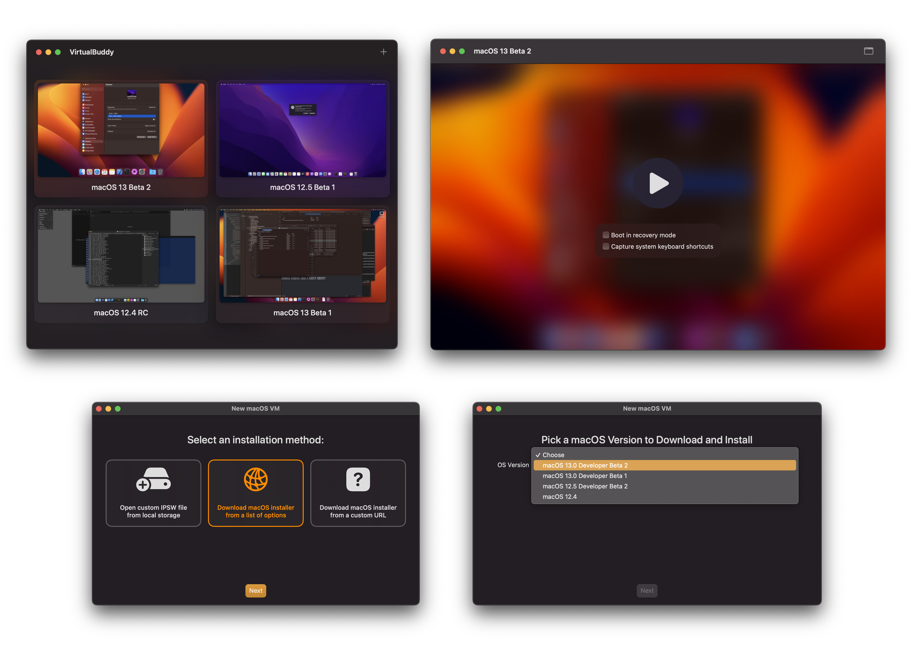

# VirtualBuddy

VirtualBuddy can virtualize macOS 12 and later on Apple Silicon, with the goal of offering features that are useful to developers who need to test their apps on multiple versions of macOS, especially betas.

**Requires macOS 12.3, XCode beta 14, and an Apple Silicon Mac**

⚠️ WARNING: This project is experimental. Things might break or not work as expected.

[Download from GitHub Releases](https://github.com/insidegui/VirtualBuddy/releases)

### Feature Checklist

- [x] Ability to boot any version of macOS 12 or macOS 13, including betas
- [x] Built-in installation wizard
	- [x] Select from a collection of restore images available on Apple's servers
	- [x] Install the latest stable version of macOS
	- [x] Local restore image IPSW file
	- [x] Custom restore image URL
- [x] Boot into recovery mode (in order to disable SIP, for example)
- [x] Networking and file sharing support
- [x] Clipboard sharing (without the need to be running macOS Ventura) (experimental ¹)
- [x] Customize virtual machine hardware configuration
- [ ] Edit NVRAM variables

_¹ To enable clipboard sharing, build the `VirtualBuddyGuest` scheme, then copy the `VirtualBuddyGuest` app to the virtual machine (through file sharing, for example) and run it. This will keep the clipboard in sync between the guest and host machines. The feature is experimental, so it might be buggy and it's definitely not secure._

### Tips and Tricks

#### Taking Advantage of APFS

Sometimes when trying things out in the OS installed in one of the virtual machines, things might break, requiring a full install of the guest operating system again, which is a pain.

Thanks to APFS cloning though, you can just duplicate a virtual machine within your library folder (using Command + D in Finder), and the copy will take almost no additional disk space. This way you can have a "clean" copy of your VM, do whatever you want with a duplicate of it, and then throw the copy away and re-duplicate the clean version if things break.

#### Screen Resolution

VirtualBuddy sets up its virtual machines to have the same screen resolution as the host's main screen. This is great if you want to use the VM in full screen and take advantage of the entire resolution of your Mac's display.

The default mode the VM OS selects for the display uses the native resolution that's available to it though, which can make things look really small. In order to address this, go into System Preferences > Displays within the guest operating system and choose a scaled resolution.

## Building

**Xcode 14** is required.

- Open the `VirtualBuddy/Config/Signing.xcconfig` file
- Set the `VB_BUNDLE_ID_PREFIX` variable to something unique like `com.yourname.`
- Select the VirtualBuddy project in the Xcode sidebar
- Under "Targets", select "VirtualBuddy"
- Go to the Signing & Capabilities tab and select your development team under Signing > Team
- Repeat the same process for the "VirtualBuddyGuest" target
- Build the `VirtualBuddy` scheme (the one that **doesn't** have `(Managed)` in its name)
