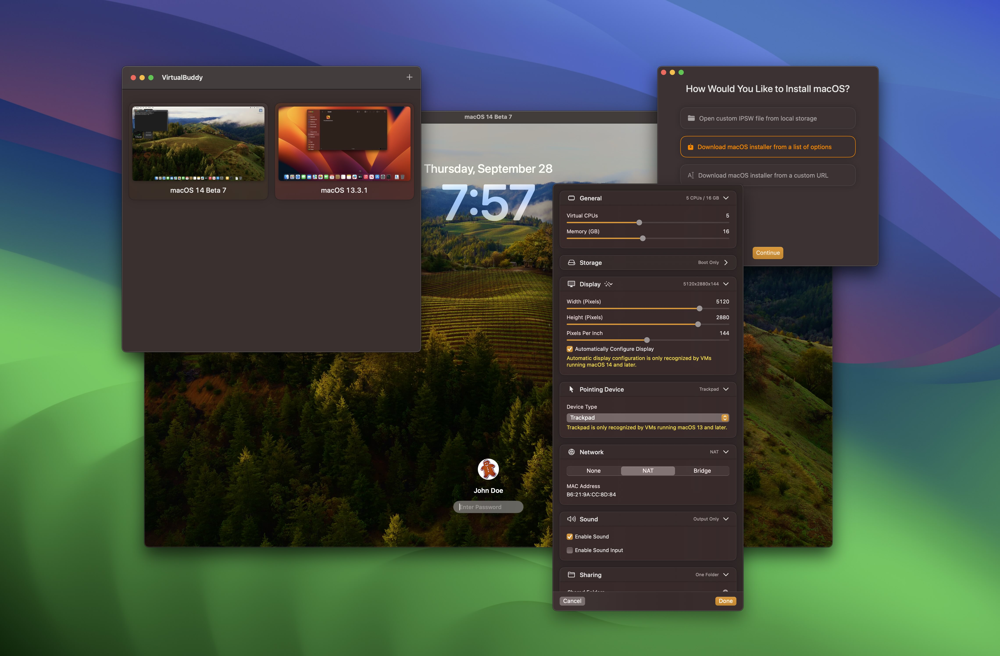
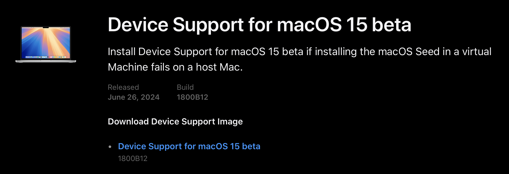
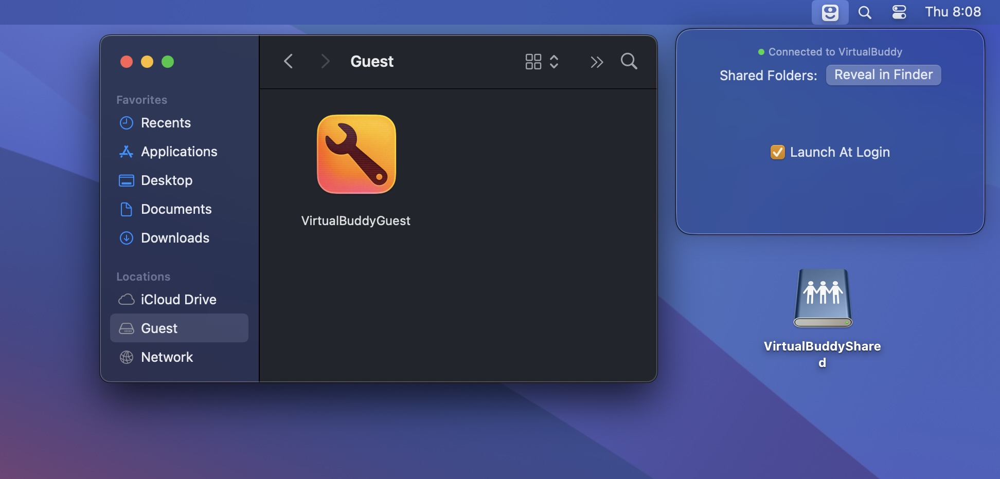

# VirtualBuddy

VirtualBuddy can virtualize macOS 12 and later on Apple Silicon, with the goal of offering features that are useful to developers who need to test their apps on multiple versions of macOS, especially betas.



## System Requirements

- **Apple Silicon Mac**
- macOS 13 or later

### Installing macOS

To install a macOS virtual machine, you can select from a list of macOS versions provided by VirtualBuddy, which will automatically download and install the selected version. You may also provide your own IPSW link or select from an IPSW you have already downloaded.

### Installing macOS Betas

If you’d like to run a virtual machine with a macOS beta that’s more recent than the one you’re currently running, such as a macOS 15 virtual machine running in a macOS 14 host, then you’ll need the latest device support package from Apple. 

Device support packages are sometimes made available by Apple directly, but they’re always included and installed automatically with the latest Xcode beta. These can be obtained from the [Apple Developer portal](https://developer.apple.com/download).



## Download

VirtualBuddy is free and open-source. If you’d like to support its development, [you may purchase it on Gumroad](https://insidegui.gumroad.com/l/virtualbuddy) or [sponsor my work on GitHub](https://github.com/sponsors/insidegui).

If you’d just like to download the latest version, [go to GitHub releases](https://github.com/insidegui/VirtualBuddy/releases/latest).

### Feature Checklist

- [x] Ability to boot any version of macOS 12 or macOS 13, including betas
- [x] Ability to boot some ARM-based Linux distros (tested with Ubuntu Server and Ubuntu Desktop)
- [x] Built-in installation wizard
	- [x] Select from a collection of restore images available on Apple’s servers
	- [x] Install the latest stable version of macOS
	- [x] Local restore image IPSW file
	- [x] Custom restore image URL
	- [x] Install a Linux distro from a local .iso file
	- [x] Select from a collection of Linux distros
	- [x] Install Linux from URL
- [x] Boot into recovery mode (in order to disable SIP, for example)
- [x] Networking and file sharing support
- [x] Clipboard sharing
- [x] Customize virtual machine hardware configuration

### Tips and Tricks

#### VirtualBuddyGuest app

VirtualBuddy automatically mounts a disk image with the VirtualBuddyGuest app when you boot up a virtual machine running macOS. To install the VirtualBuddyGuest app, just select the “Guest” disk on Finder’s side bar then double-click the “VirtualBuddyGuest” app icon.

VirtualBuddyGuest enables clipboard sharing between host and guest and automatic mounting of the shared folders configured for the virtual machine.



#### Taking Advantage of APFS

Sometimes when trying things out in the OS installed in one of the virtual machines, things might break, requiring a full install of the guest operating system again, which is a pain.

Thanks to APFS cloning though, you can just duplicate a virtual machine within your library folder (using Command + D in Finder), and the copy will take almost no additional disk space. This way you can have a “clean” copy of your VM, do whatever you want with a duplicate of it, and then throw the copy away and re-duplicate the clean version if things break.

#### Sharing Folders Between Host and Virtual Machine

You can share folders from your Mac to the Virtual Machine and vice-versa using regular macOS file sharing that can be configured in System Preferences/Settings.

When both the Virtual Machine and the host are running macOS 13 or later, it’s possible to share folders directly by configuring them in the VM settings within VirtualBuddy before booting up the VM.

To mount shared folders in the VM, run the following command in the VM’s Terminal:

```bash
mkdir -p ~/Desktop/VirtualBuddyShared && mount -t virtiofs VirtualBuddyShared ~/Desktop/VirtualBuddyShared
```

## Building

**Xcode 16** is required for building on `main`.

- Open the `VirtualBuddy/Config/Signing.xcconfig` file
- Set the `VB_BUNDLE_ID_PREFIX` variable to something unique like `com.yourname.`
- Select the VirtualBuddy project in the Xcode sidebar
- Under "Targets", select "VirtualBuddy"
- Go to the Signing & Capabilities tab and select your development team under Signing > Team
- Repeat the same process for the "VirtualBuddyGuest" target
- Build the `VirtualBuddy` scheme (the one that **doesn't** have `(Managed)` in its name)